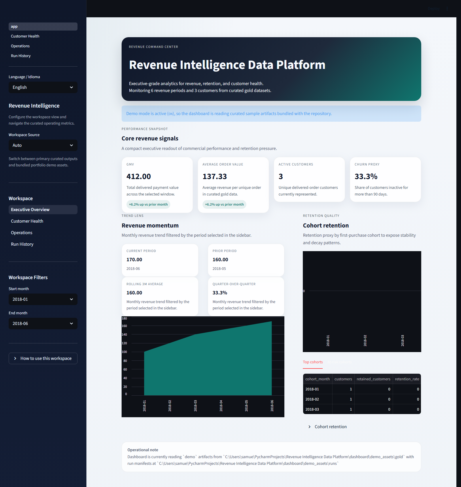
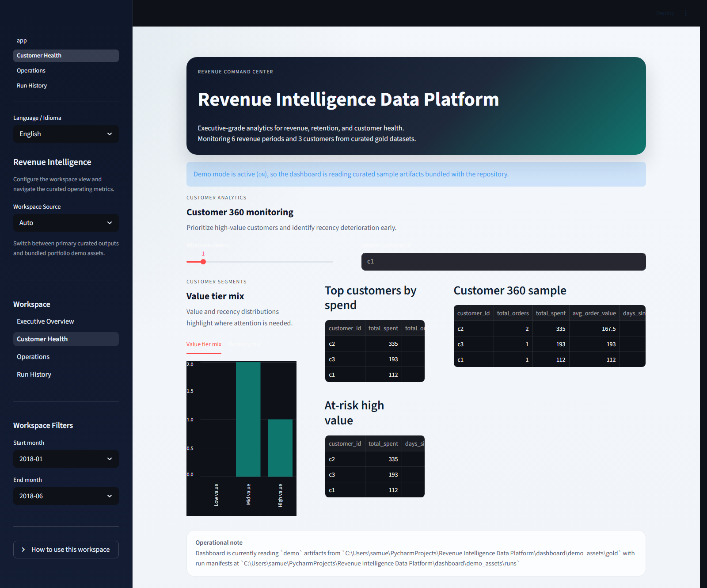
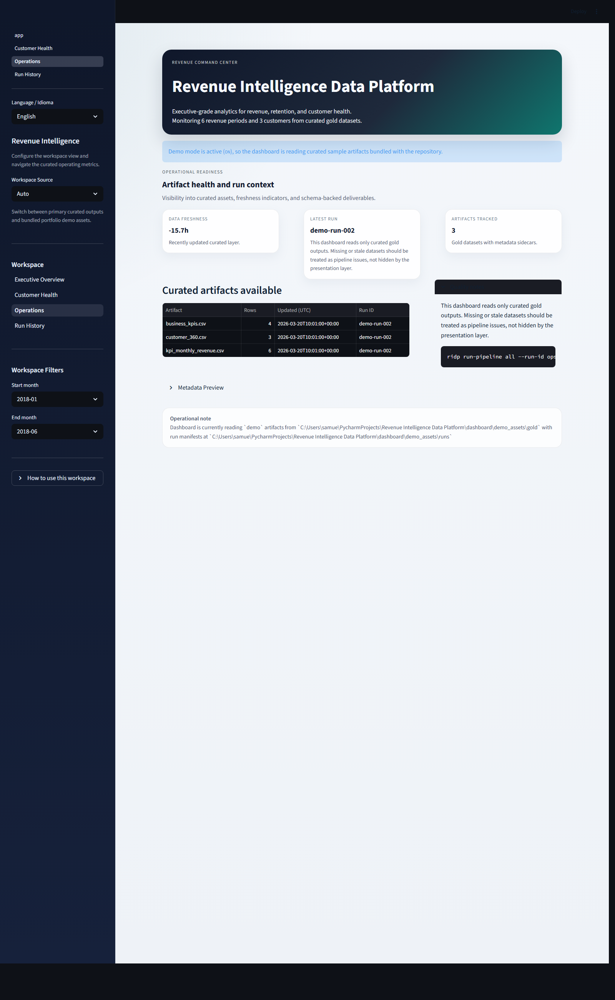
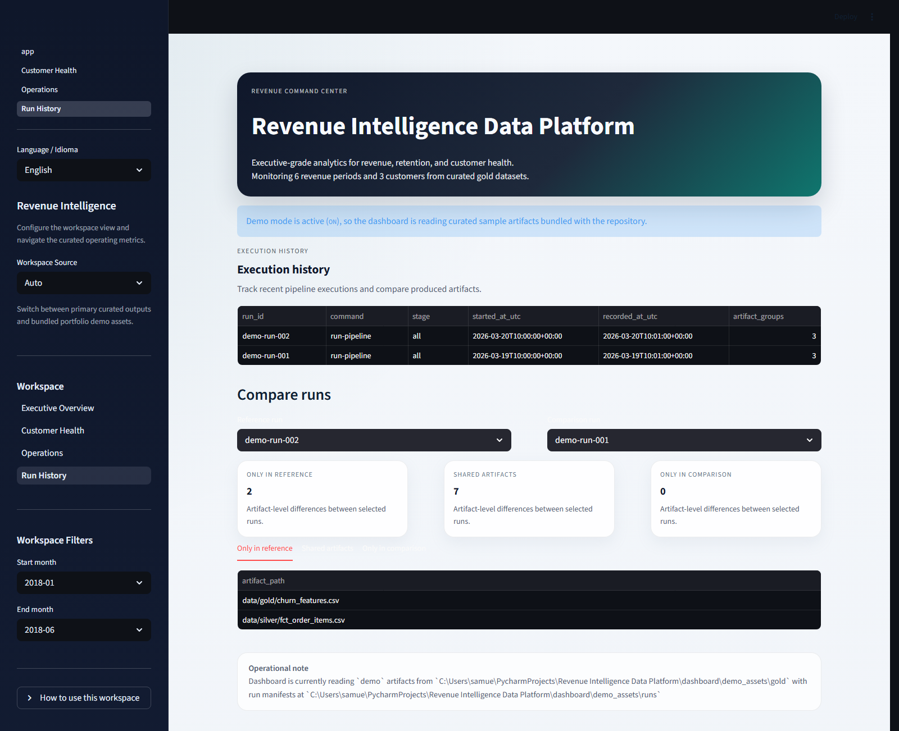

# Revenue Intelligence Data Platform

[](https://github.com/samuelmaia-analytics/Revenue-Intelligence-Platform-End-to-End-Analytics-ML-System/actions/workflows/ci.yml)

End-to-end revenue intelligence platform over the Olist dataset. The project is organized as a production-minded local stack: contract-aware ingestion, layered transformations, model training entry points, a SQLite serving layer, and a Streamlit dashboard exposed through a single CLI surface.

## Executive Summary

This repository is built to demonstrate senior-level data platform execution rather than notebook-only analysis:

- reproducible local setup with `pyproject.toml`, `Makefile`, and packaged CLIs
- explicit `raw -> bronze -> silver -> gold -> serving` flow
- failure-first data contracts for schema drift, invalid states, and empty critical outputs
- operator-oriented run artifacts, metadata sidecars, manifests, and health checks
- dashboard usability without hiding operational issues
- automated quality gates for format, lint, typing, tests, and package build

## What The Platform Solves

Commercial teams need reliable answers to questions such as:

- how revenue evolves over time
- which customers are at risk of churn
- how customer value and retention change across cohorts
- whether the current business trajectory supports short-term revenue forecasts

The platform converts raw Olist extracts into curated analytical assets, trainable features, lightweight model artifacts, and reviewable dashboard outputs.

## Core Capabilities

- Ingestion pipeline with explicit required-column validation
- Bronze, silver, and gold datasets with companion `.metadata.json` sidecars
- Feature generation for churn and revenue model training
- Multipage Streamlit dashboard for KPI monitoring, customer health, operations, and run history
- SQLite serving store for stable curated reads
- Health checks for dataset freshness, metadata presence, and runtime readiness
- CLI-first execution for bootstrap, pipelines, health checks, training, and dashboard launch

## Architecture

```text
Raw source CSVs
  -> ingestion pipeline
  -> bronze artifacts
  -> transformation pipeline
  -> silver marts
  -> feature pipeline
  -> gold datasets
  -> analytics / model training / dashboard / serving store
```

Supporting references:

- [Architecture notes](docs/architecture.md)
- [Dataset source notes](docs/dataset_source.md)
- [Runbook](docs/runbook.md)

## Repository Layout

```text
analytics/   KPI, retention, business metrics, and serving-store logic
dashboard/   Streamlit application and multipage views
docs/        architecture, runbook, commit convention, and dataset notes
models/      churn and revenue forecasting training flows
pipelines/   ingestion, transformation, feature generation, shared contracts
ridp/        runtime configuration, CLI entry points, dashboard launcher
tests/       regression and contract-oriented tests
```

## Technology Stack

- Python 3.11+
- pandas, numpy, scikit-learn, SQLAlchemy
- Streamlit and Altair
- pytest, Ruff, Black, mypy
- GitHub Actions and pre-commit

## Quickstart

```bash
python -m venv .venv
.venv\Scripts\activate
python -m pip install --upgrade pip
python -m pip install -e .[dev]
copy .env.example .env
pre-commit install
python -m ridp.dev_tasks bootstrap
python -m ridp.dev_tasks pipeline
python -m ridp.dev_tasks dashboard
```

If you want to validate model entry points after generating curated data:

```bash
ridp train-model churn
ridp train-model revenue --periods 3
```

## Configuration

The platform is environment-driven and defaults to project-local paths.

```bash
RIDP_RAW_DIR=data/raw
RIDP_BRONZE_DIR=data/bronze
RIDP_SILVER_DIR=data/silver
RIDP_GOLD_DIR=data/gold
RIDP_SERVING_DB=data/serving/revenue_serving.db
RIDP_MODELS_DIR=models/artifacts
RIDP_RUNS_DIR=data/run_manifests
RIDP_RUN_ARTIFACTS_DIR=data/run_artifacts
RIDP_RUN_HISTORY_DB=data/run_manifests/run_history.db
RIDP_LOG_LEVEL=INFO
RIDP_FRESHNESS_SLA_HOURS=24
RIDP_DASHBOARD_DEMO_MODE=AUTO
RIDP_DASHBOARD_DEMO_ASSETS_DIR=dashboard/demo_assets
```

Dashboard source modes:

- `AUTO`: prefer live curated outputs, fall back to bundled demo assets
- `ON`: force demo assets for walkthroughs and portfolio reviews
- `OFF`: require real generated artifacts

## CLI Surface

Primary commands:

```bash
ridp bootstrap-sample-data
ridp run-pipeline ingestion
ridp run-pipeline transformation
ridp run-pipeline features
ridp run-pipeline all
ridp run-pipeline all --run-id portfolio-demo-001
ridp check-health
ridp check-health --strict
ridp train-model churn
ridp train-model revenue --periods 6
ridp-dashboard
```

Preferred local shorthands:

```bash
make install
make bootstrap
make pipeline
make health
make lint
make test
make build
make check
make format
make precommit
make dashboard
```

Python-native fallback for environments without `make`:

```bash
python -m ridp.dev_tasks install
python -m ridp.dev_tasks lint
python -m ridp.dev_tasks test
python -m ridp.dev_tasks check
python -m ridp.dev_tasks dashboard
```

## Data Products

Bronze layer:

- normalized source columns
- ingestion timestamps
- source lineage fields

Silver layer:

- `fct_orders.csv`
- `dim_customers.csv`
- `fct_order_items.csv`

Gold layer:

- `kpi_daily_revenue.csv`
- `kpi_monthly_revenue.csv`
- `customer_360.csv`
- `churn_features.csv`
- `business_kpis.csv`

Serving layer:

- `data/serving/revenue_serving.db`

Operational artifacts:

- per-dataset `.metadata.json` sidecars
- run manifests under `data/run_manifests/`
- run snapshots under `data/run_artifacts/<run_id>/`
- run catalog and SQLite run history for traceability

## Reliability Posture

- Missing inputs fail with actionable exceptions.
- Required columns and contract-critical invalid states fail loudly.
- Transformation does not silently tolerate invalid order timestamps.
- KPI generation refuses to produce misleading outputs when critical business inputs are empty.
- Pipeline runs are traceable through shared `run_id` values and persisted operational artifacts.
- Dashboard flows support graceful fallbacks for expected demo scenarios without masking real operational failures.

## Dashboard Preview

Versioned screenshots live in `docs/assets/dashboard/`.

### Executive Overview



### Customer Health



### Operations



### Run History



For a deterministic local walkthrough:

```bash
set RIDP_DASHBOARD_DEMO_MODE=ON
ridp-dashboard
```

## Engineering Workflow

Project collaboration is documented in [CONTRIBUTING.md](CONTRIBUTING.md). Commit message rules are documented in [docs/commit-convention.md](docs/commit-convention.md).

Baseline validation:

```bash
make lint
make test
```

Release-ready validation:

```bash
make check
```

If `make` is not available in your shell, use:

```bash
python -m ridp.dev_tasks lint
python -m ridp.dev_tasks test
python -m ridp.dev_tasks check
```

## Automation

The repository includes:

- `pre-commit` hooks for fast local quality feedback
- GitHub issue forms and PR templates to improve change quality
- GitHub Actions CI for lint, typing, tests, and build validation
- `Makefile` targets plus `ridp-dev` / `python -m ridp.dev_tasks` for cross-platform local workflows

The `pre-commit` configuration is local-only and does not require fetching hook repositories from GitHub.

## Contribution Standards

Changes should stay focused, preserve CLI stability unless intentionally changed, and update tests or downstream consumers when schemas or artifacts move. Operator-visible behavior changes must be reflected in repository documentation.

## Roadmap

- richer anomaly detection and data quality assertions
- stronger model evaluation reporting and artifact governance
- browser-level dashboard smoke coverage
- clearer evolution path from local portfolio stack to hosted deployment
