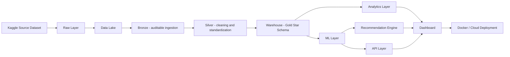
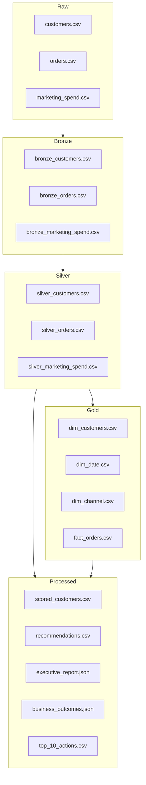
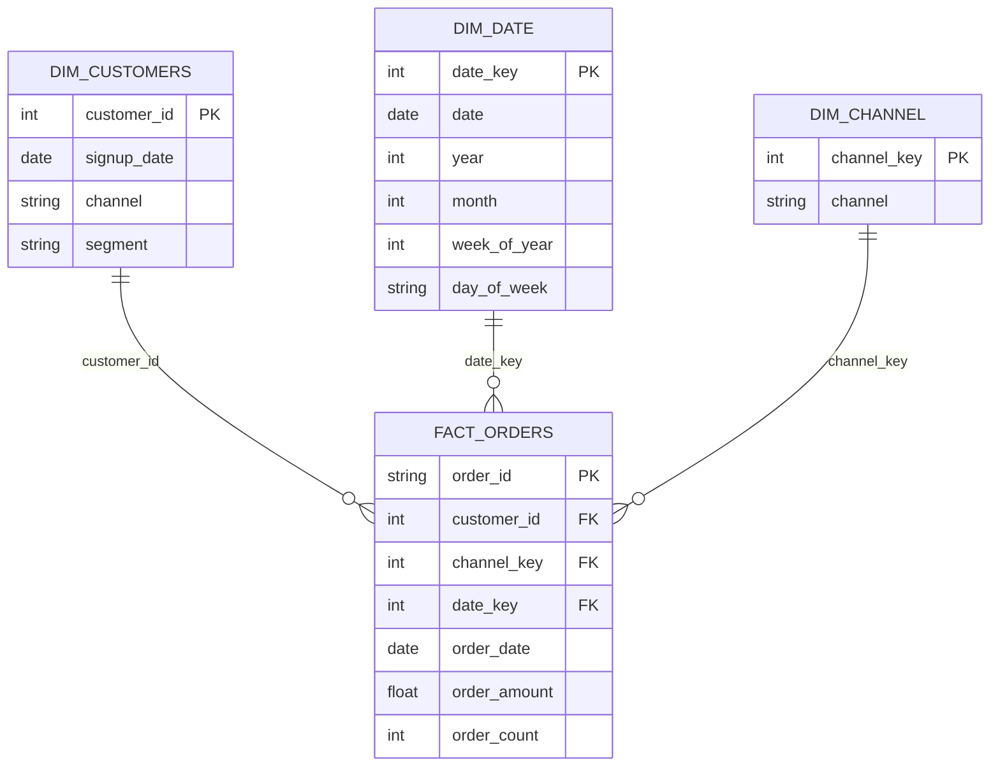
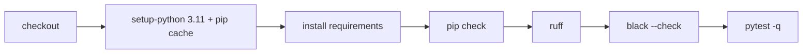

# Revenue Intelligence Platform - Executive Analytics & ML System

[](https://www.python.org/)
[](https://streamlit.io/)
[](https://scikit-learn.org/)
[](https://www.docker.com/)
[](https://github.com/samuelmaia-analytics/Revenue-Intelligence-Platform-End-to-End-Analytics-ML-System/actions/workflows/ci.yml)
[](LICENSE)

[Leia em Português](README.pt-BR.md)
LinkedIn: https://linkedin.com/in/samuelmaia-analytics

## API Security Spotlight

> Secure-by-default serving API: versioned endpoints (`/api/v1/*`), authenticated scoring with `X-API-Key`/Bearer token, and release runbook for reproducible operations.

## Business Impact (Latest Run)

- Simulated net impact (Top 10 actions): **2,550.13**
- Simulated ROI (Top 10 actions): **1.58x**
- Revenue uplift over baseline (90d, Top 10 actions): **+4,165.63**

## Product Preview


## What Problem It Solves

- Commercial teams need one prioritized view of who to retain, upsell, or deprioritize.
- Finance and growth need transparent unit economics (`LTV/CAC`) by channel to reallocate spend fast.
- Leadership needs a single weekly board pack with KPI trends, risk signals, and top actions.

## Who Should Care About This

- Recruiters: validates end-to-end ownership (data engineering, ML, API, dashboard, CI/CD) in one production-style repository.
- Heads of Data/Analytics: shows governance discipline (contracts, versioned models, quality gates, runbook) and business KPI alignment.
- Tech/Analytics Leads: provides a reusable blueprint for turning behavioral data into prioritized actions with measurable ROI.

## Summary

- [API Security Spotlight](#api-security-spotlight)
- [Product Preview](#product-preview)
- [What Problem It Solves](#what-problem-it-solves)
- [Who Should Care About This](#who-should-care-about-this)
- [Live App](#live-app)
- [30-Second Quickstart](#30-second-quickstart)
- [Executive Summary](#executive-summary)
- [Business Impact (Latest Run)](#business-impact-latest-run)
- [Business Outcomes](#business-outcomes)
- [Scope and Capabilities](#scope-and-capabilities)
- [Architecture](#architecture)
- [Data Lineage](#data-lineage)
- [Repository Structure](#repository-structure)
- [Data Source](#data-source)
- [Star Schema (Gold)](#star-schema-gold)
- [SQL Organization](#sql-organization)
- [Local Run (Windows / PowerShell)](#local-run-windows--powershell)
- [CLI](#cli)
- [Task Automation (Makefile)](#task-automation-makefile)
- [Serving API (FastAPI)](#serving-api-fastapi)
- [Data Contract](#data-contract)
- [Operating Standards](#operating-standards)
- [Runbook](#runbook)
- [Engineering Quality](#engineering-quality)
- [CI](#ci)
- [Docker](#docker)
- [Main Outputs](#main-outputs)
- [Streamlit Cloud](#streamlit-cloud)

## Live App

Streamlit Cloud:
- https://revenue-intelligence-platform.streamlit.app/

## 30-Second Quickstart

```powershell
py -3.11 -m venv .venv
.\.venv\Scripts\activate
copy .env.example .env
python -m pip install -e .[dev]
make pipeline
make serve-api
```

## Executive Summary

Revenue Intelligence Platform is an end-to-end decision system that converts customer behavior data into commercial priorities.

This version includes a mature layered data architecture (`raw -> bronze -> silver -> gold`) with a formal Star Schema and structured SQL domains for analytics.

## Business Outcomes

- Prioritized customer action list with estimated financial impact
- Channel efficiency visibility with `LTV/CAC` and unit economics
- Customer-level churn risk and next purchase probability
- Executive narrative for weekly business reviews

## Scope and Capabilities

- Data ingestion from Kaggle source with synthetic fallback
- Layered pipeline: raw, bronze, silver, gold
- Feature engineering and customer-level scoring
- Star schema outputs for analytics interoperability
- KPI layer: LTV, CAC, RFM, Cohort Retention, Unit Economics
- ML layer: churn + next purchase prediction
- Recommendation engine for next best action
- Executive Streamlit dashboard with governance and exports
  (`Executive Overview`, `Risk & Growth`, `Action List`)
- Structured SQL domains (`ddl/` and `analytics/`)

## Architecture



## Data Lineage



## Repository Structure

```text
revenue-intelligence-platform/
|- app/
|  \- streamlit_app.py
|- contracts/
|  |- data_contract.py (compatibility shim)
|  \- v1/
|     \- data_contract.py
|- api/
|  \- main.py (compatibility shim)
|- services/
|  \- api/
|     \- main.py
|- data/
|  |- raw/
|  |- bronze/
|  |- silver/
|  |- gold/
|  \- processed/
|- notebooks/
|- src/
|- sql/
|  |- ddl/
|  \- analytics/
|- main.py
|- requirements.txt
|- requirements-dev.txt
|- pytest.ini
|- Dockerfile
|- Dockerfile.api
|- README.md
\- README.pt-BR.md
```

## Data Source

Primary file:
- `data/raw/E-commerce Customer Behavior - Sheet1.csv`

Source:
- Kaggle dataset: `E-commerce Customer Behavior Dataset`

Automatically mapped into:
- `customers.csv`
- `orders.csv`
- `marketing_spend.csv`

Then normalized into:
- `data/bronze/*.csv`
- `data/silver/*.csv`
- `data/gold/dim_*.csv` and `data/gold/fact_*.csv`

## Star Schema (Gold)

- Dimensions: `dim_date`, `dim_customers`, `dim_channel`
- Fact: `fact_orders`
- Standardized measures: `order_amount`, `order_count`



## SQL Organization

- `sql/ddl/`: schema creation scripts per table/domain
- `sql/analytics/`: executive queries (revenue KPIs, channel efficiency, churn watchlist)
- `sql/create_tables.sql`: consolidated bootstrap script

## Local Run (Windows / PowerShell)

```powershell
py -3.11 -m venv .venv
.\.venv\Scripts\activate
python -m pip install --upgrade pip
copy .env.example .env
python -m pip install -e .[dev]
rip-pipeline run
rip-app
```

Environment overrides:
- `RIP_DATA_DIR`
- `RIP_SEED`
- `RIP_LOG_LEVEL`
- `RIP_APP_LANG_MODE` (`bilingual` or `international`)

## CLI

```powershell
rip-pipeline run
rip-pipeline run --seed 123 --log-level DEBUG
rip-api
rip-app
```

## Task Automation (Makefile)

```bash
make install-dev
make pipeline
make serve-api
make quality
make docker-build
```

## Serving API (FastAPI)

Start API locally:

```powershell
python -m uvicorn services.api.main:app --reload --host 0.0.0.0 --port 8000
```

Available endpoints:
- `GET /api/v1/health`: service status, input schema, model versions (`run_id`, `data_version`) and telemetry
- `POST /api/v1/score`: churn + next purchase prediction for one or multiple customers
- Backward-compatible aliases: `GET /health` and `POST /score`

Security and quota (`/api/v1/score`):
- API key required in `demo` mode (default): `X-API-Key` or `Authorization: Bearer <key>` (`X-API-Token` kept as legacy alias)
- In-memory rate limit per token/IP (`RIP_API_RATE_LIMIT_PER_MINUTE`, default `60`)
- Auth mode: `RIP_API_AUTH_MODE=demo|strict|off`
- Key env vars: `RIP_API_KEYS` (comma-separated), `RIP_API_KEY` (single key fallback)

Production telemetry (health + logs):
- `prediction_latency_ms`
- `request_volume`
- `model_version_usage`

Example `curl` with API key:

```bash
curl -X POST "http://localhost:8000/api/v1/score" \
  -H "Content-Type: application/json" \
  -H "X-API-Key: rip-demo-token-v1" \
  -d '{
    "records": [
      {
        "recency_days": 21,
        "frequency": 7,
        "monetary": 1450.0,
        "avg_order_value": 207.0,
        "tenure_days": 360,
        "arpu": 148.0,
        "channel": "Organic",
        "segment": "SMB"
      }
    ]
  }'
```

Example request body:

```json
{
  "records": [
    {
      "recency_days": 21,
      "frequency": 7,
      "monetary": 1450.0,
      "avg_order_value": 207.0,
      "tenure_days": 360,
      "arpu": 148.0,
      "channel": "Organic",
      "segment": "SMB"
    }
  ]
}
```

## Data Contract

Versioned contract source of truth is `contracts/v1/data_contract.py`:
- Input serving schema: `ScoreRequest` / `ScoreInputRecord`
- Gold output schema: `DimCustomersContract`, `DimDateContract`, `DimChannelContract`, `FactOrdersContract`
- `contracts/data_contract.py` remains as backward-compatible import path.

Automated validation:
- `tests/test_output_contract.py` validates required columns from the contract.

## Operating Standards

- Service entrypoint: `services/api/main.py` (canonical), `api/main.py` (backward-compatible shim).
- Contract source of truth: `contracts/v1/data_contract.py` (`contracts/data_contract.py` and `src/data_contract.py` kept as compatibility import paths).
- Repository structure standard: `docs/repository_structure.md`.
- PR governance: `.github/pull_request_template.md` and CI workflow `.github/workflows/ci.yml`.

## Runbook

### Dev
- Install dependencies: `make install-dev`
- Bootstrap runtime env: `copy .env.example .env`
- Generate artifacts locally: `make pipeline`
- Start serving API: `make serve-api`
- Start Streamlit app: `make serve-app`

### CI
- Required checks: `ruff`, `black --check`, `mypy`, `pytest --cov`
- Image checks: `docker build` (app) and `docker build -f Dockerfile.api` (API)
- Workflow source: `.github/workflows/ci.yml`

### Release
- Build images: `make docker-build`
- Verify API health in runtime: `GET /api/v1/health`
- Validate scoring contract in runtime: `POST /api/v1/score`
- Keep release notes short and business-first (impact/ROI/uplift deltas).
- Register API/contract breaking changes in `CHANGELOG.md` under `Breaking Changes`.
- Release notes source: `docs/releases/v1.0.0.md`
- If the sidebar shows only `1 tag`, publish the GitHub Release explicitly:
  `gh release create v1.0.0 --title "v1.0.0" --notes-file docs/releases/v1.0.0.md`
- If the release already exists, update it:
  `gh release edit v1.0.0 --title "v1.0.0" --notes-file docs/releases/v1.0.0.md`
- Validate in GitHub UI: `https://github.com/samuelmaia-analytics/Revenue-Intelligence-Platform-End-to-End-Analytics-ML-System/releases`

### Incident
- If `/api/v1/health` returns `degraded`, regenerate artifacts with `make pipeline`
- Confirm model registry files in `data/processed/registry/*`
- Rollback option: use legacy `*.joblib` artifacts already supported by the API fallback

## Engineering Quality

```powershell
.\.venv\Scripts\python.exe -m pip install -e .[dev]
.\.venv\Scripts\python.exe -m black .
.\.venv\Scripts\python.exe -m ruff check . --fix
.\.venv\Scripts\python.exe -m mypy src services
.\.venv\Scripts\python.exe -m pytest
pre-commit install
pre-commit run --all-files
```

Current quality gates:
- `tests/test_output_contract.py` validates output file generation and minimum Gold schema columns.
- `main.py` bootstraps pipeline execution with `PipelineConfig.from_env(...)` for deterministic runtime settings.

## Docker

```bash
docker build -t revenue-intelligence .
docker run -p 8501:8501 revenue-intelligence

docker build -f Dockerfile.api -t revenue-intelligence-api .
docker run -p 8000:8000 revenue-intelligence-api
```

## Main Outputs

- `data/processed/scored_customers.csv`
- `data/processed/recommendations.csv`
- `data/processed/cohort_retention.csv`
- `data/processed/unit_economics.csv`
- `data/processed/executive_report.json` (main app report with KPIs, model metrics and top 20 actions)
- `data/processed/executive_summary.json` (compact executive summary)
- `data/processed/business_outcomes.json` (business KPIs, LTV/CAC by channel and baseline-vs-scenario simulation)
- `data/processed/top_10_actions.csv` (top 10 prioritized actions with uplift, cost, net impact and simulated ROI)
- `data/processed/metrics_report.json` (auxiliary ML metrics artifact)
- `data/processed/registry/churn/model_v1/model.pkl` + `model_metadata.json` (versioned model registry)
- `data/processed/registry/churn/latest.json` (latest pointer)
- `data/processed/registry/next_purchase_30d/model_v1/model.pkl` + `model_metadata.json` (versioned model registry)
- `data/processed/registry/next_purchase_30d/latest.json` (latest pointer)
- `data/processed/dim_customers.csv`
- `data/processed/dim_date.csv`
- `data/processed/dim_channel.csv`
- `data/processed/fact_orders.csv`

## Streamlit Cloud

- Main file path: `app/streamlit_app.py`
- Dependency file: `requirements.txt`
- Kaggle CSV is versioned in `data/raw/` for deterministic cloud runs
- App language mode:
  - `RIP_APP_LANG_MODE=bilingual`: language switcher with `Portuguese (BR)` and `International (EN)`
  - `RIP_APP_LANG_MODE=international`: app locked to English only

## CI

GitHub Actions workflow at `.github/workflows/ci.yml` runs:
- `pip check` (dependency consistency)
- `ruff`
- `black --check`
- `mypy`
- `pytest --cov` with fail-under gate
- `docker build` for Streamlit image
- `docker build -f Dockerfile.api` for serving API image

PR routine:
- `.github/pull_request_template.md` enforces lint/test/docker checklist and business-impact note.

Pipeline hardening:
- pip cache enabled via `actions/setup-python`
- `concurrency` enabled (`cancel-in-progress: true`)
- minimal workflow permissions (`contents: read`)




