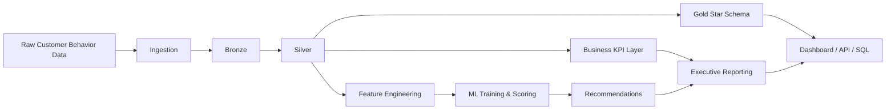

# Revenue Intelligence Platform

End-to-end revenue intelligence platform that turns customer behavior data into reproducible analytics, business KPIs, ML predictions, and executive actions.

[](https://www.python.org/)
[](https://streamlit.io/)
[](https://scikit-learn.org/)
[](https://www.docker.com/)
[](https://github.com/samuelmaia-analytics/Revenue-Intelligence-Platform-End-to-End-Analytics-ML-System/actions/workflows/ci.yml)

[Leia em Português](README.pt-BR.md)

## Live App

Streamlit Cloud:

- https://revenue-intelligence-platform.streamlit.app/

## Why This Project Stands Out

- Built as a platform, not a notebook: clear layers for ingestion, transformation, analytics, ML, reporting, API, and dashboard
- Business-first outputs: churn risk, next-purchase propensity, channel efficiency, prioritized actions, and impact simulation
- Reproducible and production-minded: pipeline manifest, data quality report, model registry, tests, and versioned serving API
- Platform operations: optional Prefect flow, SQLite warehouse persistence, drift monitoring, calibration diagnostics, and semantic metrics

## Executive Snapshot

- Business problem: convert customer behavior data into revenue protection and growth decisions
- Core users: Revenue Ops, Marketing, Finance, Customer Success, and leadership
- Primary outcomes: prioritized accounts, centralized KPIs, explainable model outputs, and executive storytelling

## Business Problem

Commercial teams rarely need another notebook. They need a decision system that answers:

- Which customers are most likely to churn and worth saving?
- Which segments are most likely to buy again and worth upselling?
- Which acquisition channels are efficient enough to scale?
- What is the expected business impact of the next 10 actions?

This repository is structured as a real analytics platform instead of a single experiment. It preserves the original scope, but now makes the flow explicit from raw data to executive insight.

## Platform View



## Architecture

### Layered flow

- `src/ingestion.py`: raw dataset ingestion and bronze persistence
- `src/transformation.py`: silver standardization and customer feature engineering
- `src/warehouse.py`: gold star schema for analytics interoperability
- `src/metrics.py`: centralized revenue KPI calculations and business metric snapshots
- `src/analytics.py`: analytics artifact generation independent from model training
- `src/modeling.py`: preprocessing, training, scoring, model registry, and business-facing interpretation
- `src/recommendation.py`: action prioritization logic
- `src/reporting.py`: executive outputs and simulation artifacts
- `src/quality.py`: data quality gates and integrity reports
- `src/orchestration.py`: reproducible end-to-end pipeline orchestration
- `src/config.py`: runtime configuration and path management

### Reproducibility and controls

- deterministic seed via `PipelineConfig`
- explicit directories for `raw`, `bronze`, `silver`, `gold`, `processed`, `warehouse`
- generated `pipeline_manifest.json` with stage timings and output inventory
- generated `quality_report.json` with row counts, duplicates, nulls, and referential checks
- generated `monitoring_report.json` with drift and calibration diagnostics
- generated `semantic_metrics_catalog.json` from declarative metric definitions
- versioned model registry in `data/processed/registry`

Supporting documentation:

- [docs/architecture.md](/C:/Users/samue/PycharmProjects/Revenue-Intelligence-Platform-End-to-End-Analytics-ML-System/docs/architecture.md)

## Analytics Workflow

### Raw -> transformed -> analytics -> ML -> insight

1. Raw source is loaded from the Kaggle file in `data/raw/` or generated synthetically as a deterministic fallback.
2. Bronze keeps an auditable copy with ingestion metadata.
3. Silver applies schema checks, deduplication, typing, null handling, and referential cleanup.
4. Feature engineering creates a customer-level analytical base with recency, frequency, monetary value, tenure, ARPU, and forward-looking targets.
5. Gold publishes `dim_*` and `fact_orders.csv` so analytics can run independently from the ML layer.
6. Centralized KPI logic computes LTV, CAC, RFM, cohort retention, unit economics, and a KPI snapshot.
7. ML trains churn and next-purchase models with temporal evaluation and business driver summaries.
8. Recommendation logic translates scores into action types.
9. Reporting packages the results into executive artifacts, action simulations, and dashboard-ready tables.
10. Core analytical outputs are persisted into SQLite for warehouse-style downstream consumption.

## ML Approach

### Targets

- `is_churned`: no purchase in the forward 90-day window for eligible customers
- `next_purchase_30d`: purchase propensity in the forward 30-day window

### Features

- behavioral: `recency_days`, `frequency`, `monetary`, `avg_order_value`
- lifecycle: `tenure_days`, `arpu`
- business context: `channel`, `segment`

### Modeling choices

- churn: `RandomForestClassifier`
- next purchase: `LogisticRegression`
- preprocessing: numeric scaling + categorical one-hot encoding
- validation: temporal split with stratified fallback when needed

### Why this matters for the business

- churn predictions support retention budget allocation
- next purchase propensity supports upsell timing and CRM prioritization
- model outputs are converted into clear actions, not left as isolated scores
- `metrics_report.json` now includes top business drivers for each model

## Centralized Revenue KPIs

Business KPI logic is no longer scattered across notebooks or reporting code.

Key metrics:

- `LTV`
- `CAC`
- `LTV/CAC`
- `ARPU`
- `RFM segmentation`
- `Cohort retention`
- `Contribution margin`
- `Payback period`
- `High churn risk share`
- `Top-10 action impact simulation`

Primary code:

- [src/metrics.py](/C:/Users/samue/PycharmProjects/Revenue-Intelligence-Platform-End-to-End-Analytics-ML-System/src/metrics.py)
- [src/business_rules.py](/C:/Users/samue/PycharmProjects/Revenue-Intelligence-Platform-End-to-End-Analytics-ML-System/src/business_rules.py)

## Executive Outputs

Main generated artifacts in `data/processed/`:

- `customer_features.csv`
- `scored_customers.csv`
- `recommendations.csv`
- `ltv.csv`
- `cac_by_channel.csv`
- `rfm_segments.csv`
- `cohort_retention.csv`
- `unit_economics.csv`
- `kpi_snapshot.json`
- `metrics_report.json`
- `executive_report.json`
- `executive_summary.json`
- `business_outcomes.json`
- `top_10_actions.csv`
- `quality_report.json`
- `pipeline_manifest.json`
- `monitoring_report.json`
- `semantic_metrics_catalog.json`
- `data/warehouse/revenue_intelligence.db`

These outputs support different audiences:

- operators: scored portfolio and recommended action list
- finance/growth: unit economics and channel efficiency
- leadership: executive summary and business outcome simulation
- engineering: data quality report, model registry, manifest

## Dashboard and Storytelling

The Streamlit app is positioned as an executive operating layer, not only a chart viewer.

Current storytelling outputs include:

- business context cards
- portfolio KPI view
- channel efficiency
- cohort retention
- risk and growth lenses
- model performance summary
- top business drivers from both models
- drift status and calibration signal
- interactive scenario planning controls
- prioritized action list
- simulated impact for the top 10 interventions

App entrypoint:

- [app/streamlit_app.py](/C:/Users/samue/PycharmProjects/Revenue-Intelligence-Platform-End-to-End-Analytics-ML-System/app/streamlit_app.py)

## API

FastAPI serving layer:

- health endpoint with telemetry and model registry metadata
- authenticated scoring endpoint
- versioned routes under `/api/v1/*`

Primary service:

- [services/api/main.py](/C:/Users/samue/PycharmProjects/Revenue-Intelligence-Platform-End-to-End-Analytics-ML-System/services/api/main.py)

## Scheduled Orchestration

The repository now includes an optional Prefect entrypoint for scheduled production-style runs:

- [src/prefect_flow.py](/C:/Users/samue/PycharmProjects/Revenue-Intelligence-Platform-End-to-End-Analytics-ML-System/src/prefect_flow.py)

Example:

```powershell
python -c "from src.prefect_flow import run_prefect_flow; run_prefect_flow()"
```

If Prefect is not installed, the module fails with a clear runtime message instead of silently degrading.

## Warehouse Persistence

The pipeline now persists core analytics tables into a local SQLite warehouse:

- database path: `data/warehouse/revenue_intelligence.db`
- tables: `dim_customers`, `dim_date`, `dim_channel`, `fact_orders`, `customer_features`, `scored_customers`, `recommendations`, `unit_economics`, `top_10_actions`

This keeps the project closer to a real analytics platform and reduces coupling to CSV-only consumption.

## Monitoring and Governance

- `monitoring_report.json`: feature drift status and calibration diagnostics
- `monitoring_baseline.json`: reference distribution snapshot for future runs
- `metrics/semantic_metrics.json`: dbt-style semantic metric definitions
- `semantic_metrics_catalog.json`: exported catalog used by downstream consumers

## dbt Semantic Layer

The repository now includes a dedicated dbt project on top of the SQLite warehouse:

- [dbt/dbt_project.yml](/C:/Users/samue/PycharmProjects/Revenue-Intelligence-Platform-End-to-End-Analytics-ML-System/dbt/dbt_project.yml)
- [dbt/models/marts/finance/portfolio_semantic_metrics.sql](/C:/Users/samue/PycharmProjects/Revenue-Intelligence-Platform-End-to-End-Analytics-ML-System/dbt/models/marts/finance/portfolio_semantic_metrics.sql)
- [dbt/models/marts/finance/channel_semantic_metrics.sql](/C:/Users/samue/PycharmProjects/Revenue-Intelligence-Platform-End-to-End-Analytics-ML-System/dbt/models/marts/finance/channel_semantic_metrics.sql)

What it adds:

- staging models over the warehouse tables
- finance-oriented semantic metric marts
- dbt-native tests for curated models
- alignment between `metrics/semantic_metrics.json` and the dbt semantic model

## Repository Structure

```text
.
|- app/
|- contracts/
|- data/
|  |- raw/
|  |- bronze/
|  |- silver/
|  |- gold/
|  \- processed/
|- docs/
|- notebooks/
|- services/
|  \- api/
|- sql/
|- src/
|- tests/
|- main.py
\- README.md
```

## Local Run

```powershell
py -3.11 -m venv .venv
.\.venv\Scripts\activate
python -m pip install --upgrade pip
python -m pip install -r requirements.txt -r requirements-dev.txt
python main.py
python -m streamlit run .\app\streamlit_app.py
python -m uvicorn services.api.main:app --reload --host 0.0.0.0 --port 8000
```

## CLI

```powershell
python -m src.pipeline run
python -m src.pipeline run --seed 123 --log-level DEBUG
```

### Environment overrides

- `RIP_DATA_DIR`
- `RIP_SEED`
- `RIP_LOG_LEVEL`
- `RIP_APP_LANG_MODE`
- `RIP_MODEL_DIR`
- `RIP_API_AUTH_MODE`
- `RIP_API_KEYS`

## Testing and Quality

```powershell
.\.venv\Scripts\python.exe -m pytest -q
```

Current automated coverage includes:

- pipeline output contract validation
- API behavior
- transformation integrity
- reporting outputs
- centralized KPI behavior
- preprocessing checks
- data quality gate behavior
- warehouse persistence
- drift monitoring outputs
- semantic metric catalog export
- scenario simulation logic
- dbt project structure and semantic model alignment

## Why This Looks Senior

- clear separation between analytics and ML
- KPI layer treated as a business contract
- reproducible execution with manifest and registry
- data quality built into the pipeline, not treated as an afterthought
- model interpretation linked to commercial action
- outputs designed for leadership storytelling and operational follow-through
- project structured as a platform blueprint, not a one-off notebook experiment

## Future Improvements

- add true production scheduler deployment examples for Prefect or Airflow
- move SQLite persistence to a cloud warehouse target such as BigQuery, Snowflake, or Postgres
- add alerting thresholds and notification hooks for drift and quality regressions
- expose write-back workflow for approved actions from the dashboard
- add dbt exposures, docs site publishing, and source freshness checks
