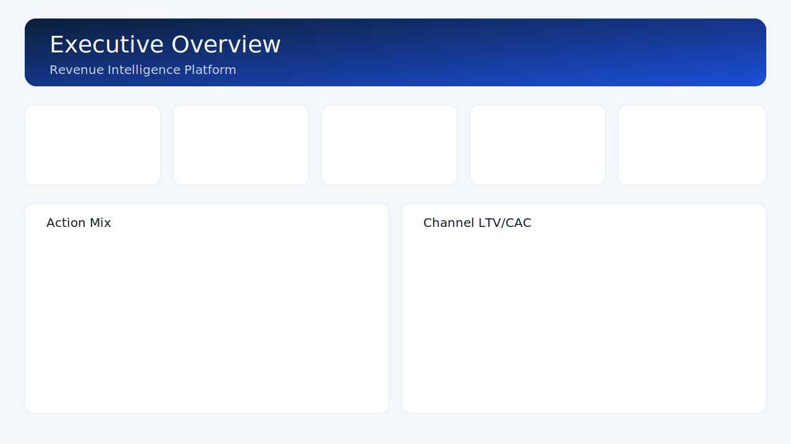
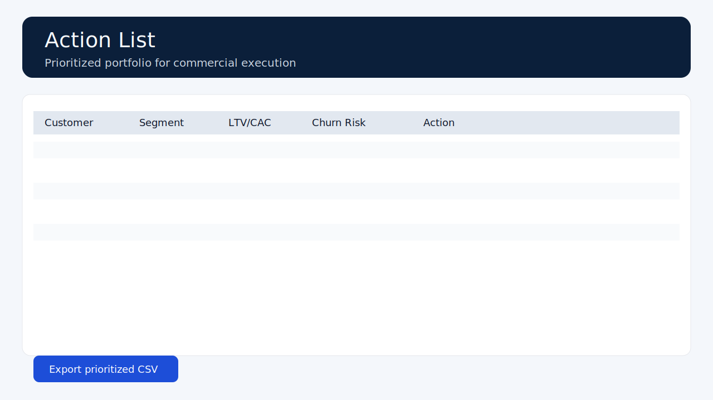
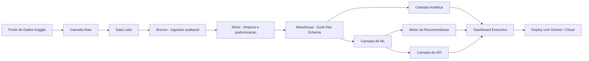
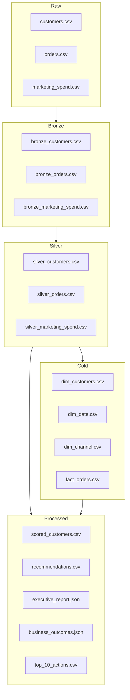
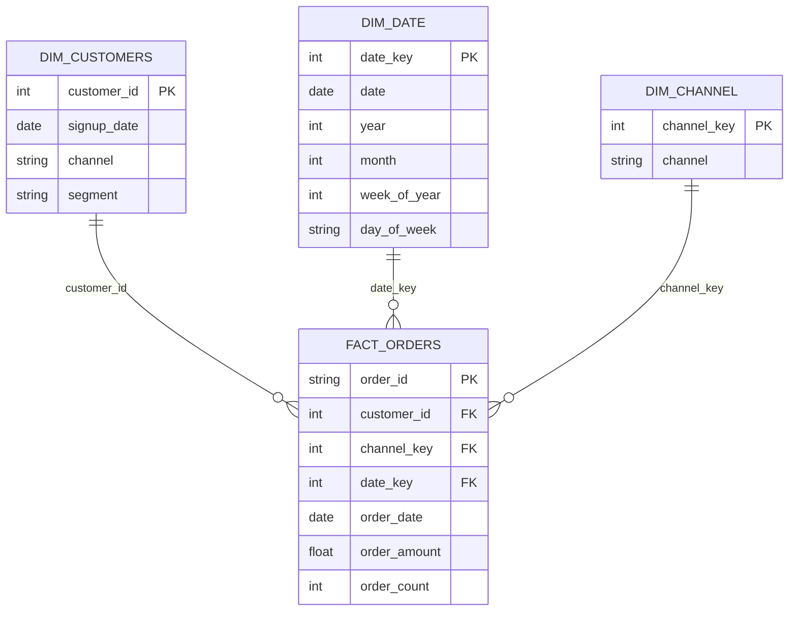
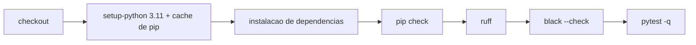

# Revenue Intelligence Platform - Sistema Executivo de Analytics e ML

[](https://www.python.org/)
[](https://streamlit.io/)
[](https://scikit-learn.org/)
[](https://www.docker.com/)
[](https://github.com/samuelmaia-analytics/Revenue-Intelligence-Platform-End-to-End-Analytics-ML-System/actions/workflows/ci.yml)
[](LICENSE)

[Read in English](README.md)
LinkedIn: https://linkedin.com/in/samuelmaia-analytics

## Snapshot Sênior+

- Enquadramento de produto: comportamento de cliente vira ação de receita, não só dashboard.
- Enquadramento de engenharia: runtime empacotado, contratos versionados, API autenticada, CI, Docker e runbook.
- Enquadramento executivo: impacto de negócio explícito, modelo operacional e saídas orientadas à decisão.

## Destaque de Segurança da API

> API de serving secure-by-default: endpoints versionados (`/api/v1/*`), scoring autenticado com `X-API-Key`/Bearer token e runbook de release para operação reproduzível.

## Impacto de Negócio (Última Execução)

- Net impact simulado (Top 10 ações): **2.550,13**
- ROI simulado (Top 10 ações): **1,58x**
- Uplift de receita sobre baseline (90d, Top 10 ações): **+4.165,63**

## Preview do Produto




## Qual Problema Resolve

- Times comerciais precisam de uma carteira priorizada única para retenção, upsell e racionalização.
- Finanças e growth precisam de unit economics (`LTV/CAC`) por canal para realocar verba rapidamente.
- Liderança precisa de um board pack semanal com KPIs, sinais de risco e ações prioritárias.

## Por Que Este Repositório Passa Percepção Sênior+

- A base está organizada por fronteiras operacionais: pipeline, warehouse, contratos, API, app e ativos de release.
- A execução é padronizada com entry points instaláveis, automação de tarefas e configuração orientada por ambiente.
- O risco é tratado de forma explícita com autenticação, rate limiting, contratos de schema, shims de compatibilidade e gates de CI.
- O repositório explica não só como rodar, mas como operar, publicar e recuperar o sistema.

## Quem Deve Se Importar Com Isso

- Recrutadores: comprova ownership end-to-end (engenharia de dados, ML, API, dashboard, CI/CD) em um único repositório com cara de produção.
- Heads de Dados/Analytics: evidencia disciplina de governança (contratos, modelos versionados, quality gates, runbook) e alinhamento com KPI de negócio.
- Tech Leads/Analytics Leads: entrega um blueprint reutilizável para converter dados comportamentais em ações priorizadas com ROI mensurável.

## Sumário

- [Destaque de Segurança da API](#destaque-de-segurança-da-api)
- [Preview do Produto](#preview-do-produto)
- [Qual Problema Resolve](#qual-problema-resolve)
- [Por Que Este Repositório Passa Percepção Sênior+](#por-que-este-repositório-passa-percepção-sênior)
- [Quem Deve Se Importar Com Isso](#quem-deve-se-importar-com-isso)
- [App em Produção](#app-em-produ%C3%A7%C3%A3o)
- [Quickstart em 30 Segundos](#quickstart-em-30-segundos)
- [Resumo Executivo](#resumo-executivo)
- [Impacto de Negócio (Última Execução)](#impacto-de-neg%C3%B3cio-%C3%BAltima-execu%C3%A7%C3%A3o)
- [Resultados de Negócio](#resultados-de-neg%C3%B3cio)
- [Escopo e Capacidades](#escopo-e-capacidades)
- [Arquitetura](#arquitetura)
- [Linhagem de Dados](#linhagem-de-dados)
- [Estrutura do Repositório](#estrutura-do-reposit%C3%B3rio)
- [Fonte de Dados](#fonte-de-dados)
- [Star Schema (Gold)](#star-schema-gold)
- [Organização SQL](#organiza%C3%A7%C3%A3o-sql)
- [Como Rodar (Windows / PowerShell)](#como-rodar-windows--powershell)
- [CLI](#cli)
- [Automação de Tarefas (Makefile)](#automa%C3%A7%C3%A3o-de-tarefas-makefile)
- [API de Serving (FastAPI)](#api-de-serving-fastapi)
- [Contrato de Dados](#contrato-de-dados)
- [Padrões Operacionais](#padr%C3%B5es-operacionais)
- [Runbook Operacional](#runbook-operacional)
- [Qualidade de Engenharia](#qualidade-de-engenharia)
- [CI](#ci)
- [Docker](#docker)
- [Principais Saídas](#principais-sa%C3%ADdas)
- [Streamlit Cloud](#streamlit-cloud)

## App em Produção

Streamlit Cloud:
- https://revenue-intelligence-platform.streamlit.app/

## Quickstart em 30 Segundos

```powershell
py -3.11 -m venv .venv
.\.venv\Scripts\activate
copy .env.example .env
python -m pip install -e .[dev]
make pipeline
make serve-api
```

## Resumo Executivo

A Revenue Intelligence Platform é um sistema de decisão comercial de ponta a ponta que transforma dados de comportamento em prioridades executivas.

Esta versão inclui uma arquitetura de dados madura em camadas (`raw -> bronze -> silver -> gold`) com Star Schema formal e domínios SQL estruturados para analytics.

O repositório foi apresentado deliberadamente como um ativo de engenharia com cara de produção: setup reproduzível, contratos explícitos de runtime, endurecimento da API, versionamento de modelos e documentação orientada à operação.

## Avaliação em 1 Minuto

- Para recrutador, o sinal é amplitude com controle: pipeline de dados, ML, API, dashboard, CI/CD e higiene de release no mesmo repo.
- Para lead, o sinal é intenção arquitetural: o domínio é pequeno, mas as fronteiras e padrões operacionais são conscientes.
- Para engenheiro, o sinal é mantenabilidade: pacote instalável, runtime orientado por ambiente, quality gates e compatibilidade preservada quando necessário.

## Resultados de Negócio

- Carteira priorizada com impacto financeiro estimado
- Eficiência por canal com `LTV/CAC` e unit economics
- Sinalização de risco de churn e nova compra por cliente
- Narrativa executiva para rituais semanais de gestão

## Escopo e Capacidades

- Ingestão de dados com fonte Kaggle e fallback sintético
- Pipeline em camadas: raw, bronze, silver, gold
- Engenharia de features e scoring por cliente
- Saídas em Star Schema para analytics
- Camada de KPIs: LTV, CAC, RFM, Coorte, Unit Economics
- Camada de ML: churn e nova compra
- Motor de recomendação de próxima melhor ação
- Dashboard executivo com governança e exportação
  (`Executive Overview`, `Risk & Growth`, `Action List`)

## Arquitetura



## Linhagem de Dados



## Estrutura do Repositório

```text
revenue-intelligence-platform/
|- app/
|  \- streamlit_app.py
|- contracts/
|  |- data_contract.py (shim de compatibilidade)
|  \- v1/
|     \- data_contract.py
|- api/
|  \- main.py (shim de compatibilidade)
|- services/
|  \- api/
|     \- main.py
|- data/
|  |- raw/
|  |- bronze/
|  |- silver/
|  |- gold/
|  \- processed/
|- notebooks/
|- src/
|- sql/
|  |- ddl/
|  \- analytics/
|- main.py
|- requirements.txt
|- requirements-dev.txt
|- pytest.ini
|- Dockerfile
|- Dockerfile.api
|- README.md
\- README.pt-BR.md
```

## Fonte de Dados

Arquivo principal:
- `data/raw/E-commerce Customer Behavior - Sheet1.csv`

Fonte:
- Dataset Kaggle: `E-commerce Customer Behavior Dataset`

Mapeado automaticamente para:
- `customers.csv`
- `orders.csv`
- `marketing_spend.csv`

Depois normalizado em:
- `data/bronze/*.csv`
- `data/silver/*.csv`
- `data/gold/dim_*.csv` e `data/gold/fact_*.csv`

## Star Schema (Gold)

- Dimensões: `dim_date`, `dim_customers`, `dim_channel`
- Fato: `fact_orders`
- Medidas padronizadas: `order_amount`, `order_count`



## Organização SQL

- `sql/ddl/`: scripts de criação de schema por tabela/domínio
- `sql/analytics/`: queries executivas (KPIs de receita, eficiência por canal, watchlist de churn)
- `sql/create_tables.sql`: script consolidado de bootstrap

## Como Rodar (Windows / PowerShell)

```powershell
py -3.11 -m venv .venv
.\.venv\Scripts\activate
python -m pip install --upgrade pip
copy .env.example .env
python -m pip install -e .[dev]
rip-pipeline run
rip-app
```

Sobrescritas via ambiente:
- `RIP_DATA_DIR`
- `RIP_SEED`
- `RIP_LOG_LEVEL`
- `RIP_APP_LANG_MODE` (`bilingual` ou `international`)

## CLI

```powershell
rip-pipeline run
rip-pipeline run --seed 123 --log-level DEBUG
rip-api
rip-app
```

## Automação de Tarefas (Makefile)

```bash
make install-dev
make pipeline
make serve-api
make quality
make docker-build
```

## API de Serving (FastAPI)

Rodar localmente:

```powershell
python -m uvicorn services.api.main:app --reload --host 0.0.0.0 --port 8000
```

Endpoints:
- `GET /api/v1/health`: status, schema de input, versão dos modelos (`run_id`, `data_version`) e telemetria
- `POST /api/v1/score`: scoring de churn e próxima compra para 1+ clientes
- Aliases legados/compatíveis: `GET /health` e `POST /score`

Segurança e quota (`/api/v1/score`):
- API key obrigatória no modo `demo` (default): `X-API-Key` ou `Authorization: Bearer <key>` (`X-API-Token` mantido como alias legado)
- Rate limit em memória por token/IP (`RIP_API_RATE_LIMIT_PER_MINUTE`, default `60`)
- Modo de autenticação: `RIP_API_AUTH_MODE=demo|strict|off`
- Variáveis de chave: `RIP_API_KEYS` (lista) e `RIP_API_KEY` (fallback único)

Telemetria de produção (health + logs):
- `prediction_latency_ms`
- `request_volume`
- `model_version_usage`

Exemplo `curl` com API key:

```bash
curl -X POST "http://localhost:8000/api/v1/score" \
  -H "Content-Type: application/json" \
  -H "X-API-Key: rip-demo-token-v1" \
  -d '{
    "records": [
      {
        "recency_days": 21,
        "frequency": 7,
        "monetary": 1450.0,
        "avg_order_value": 207.0,
        "tenure_days": 360,
        "arpu": 148.0,
        "channel": "Organic",
        "segment": "SMB"
      }
    ]
  }'
```

## Contrato de Dados

Fonte canônica versionada dos contratos em `contracts/v1/data_contract.py`:
- Input de serving: `ScoreRequest` / `ScoreInputRecord`
- Output Gold: `DimCustomersContract`, `DimDateContract`, `DimChannelContract`, `FactOrdersContract`
- `contracts/data_contract.py` permanece como caminho de import legado/compatível.

Validação automática:
- `tests/test_output_contract.py` valida colunas obrigatórias a partir desse contrato.

## Padrões Operacionais

- Entrypoint de serviço: `services/api/main.py` (canônico), `api/main.py` (shim de compatibilidade).
- Fonte única de contratos: `contracts/v1/data_contract.py` (`contracts/data_contract.py` e `src/data_contract.py` mantidos por compatibilidade de import).
- Padrão de estrutura do repositório: `docs/repository_structure.md`.
- Governança de PR: `.github/pull_request_template.md` e workflow CI `.github/workflows/ci.yml`.

## Runbook Operacional

### Dev
- Instalar dependências: `make install-dev`
- Inicializar variáveis: `copy .env.example .env`
- Gerar artefatos locais: `make pipeline`
- Subir API de serving: `make serve-api`
- Subir app Streamlit: `make serve-app`

### CI
- Checks obrigatórios: `ruff`, `black --check`, `mypy`, `pytest --cov`
- Checks de imagem: `docker build` (app) e `docker build -f Dockerfile.api` (API)
- Fonte do workflow: `.github/workflows/ci.yml`

### Release
- Build de imagens: `make docker-build`
- Verificar saúde da API em runtime: `GET /api/v1/health`
- Validar contrato de scoring em runtime: `POST /api/v1/score`
- Notas de release curtas e orientadas a negócio (impacto/ROI/uplift).
- Registrar mudanças de quebra de API/contrato no `CHANGELOG.md` em `Breaking Changes`.
- Fonte das notas de release: `docs/releases/v1.0.0.md`
- Se a lateral mostrar apenas `1 tag`, publique a GitHub Release explicitamente:
  `gh release create v1.0.0 --title "v1.0.0" --notes-file docs/releases/v1.0.0.md`
- Se a release já existir, atualize:
  `gh release edit v1.0.0 --title "v1.0.0" --notes-file docs/releases/v1.0.0.md`
- Validar na UI do GitHub: `https://github.com/samuelmaia-analytics/Revenue-Intelligence-Platform-End-to-End-Analytics-ML-System/releases`

### Incidente
- Se `/api/v1/health` retornar `degraded`, regenerar artefatos com `make pipeline`
- Confirmar arquivos de registry em `data/processed/registry/*`
- Opção de rollback: usar artefatos legados `*.joblib` suportados pelo fallback da API

## Qualidade de Engenharia

```powershell
.\.venv\Scripts\python.exe -m pip install -e .[dev]
.\.venv\Scripts\python.exe -m black .
.\.venv\Scripts\python.exe -m ruff check . --fix
.\.venv\Scripts\python.exe -m mypy src services
.\.venv\Scripts\python.exe -m pytest
pre-commit install
pre-commit run --all-files
```

Gates atuais de qualidade:
- `tests/test_output_contract.py` valida geração dos arquivos de saída e colunas mínimas do schema Gold.
- `main.py` inicializa a execução com `PipelineConfig.from_env(...)` para configuração determinística.

## Docker

```bash
docker build -t revenue-intelligence .
docker run -p 8501:8501 revenue-intelligence

docker build -f Dockerfile.api -t revenue-intelligence-api .
docker run -p 8000:8000 revenue-intelligence-api
```

## Principais Saídas

- `data/processed/scored_customers.csv`
- `data/processed/recommendations.csv`
- `data/processed/cohort_retention.csv`
- `data/processed/unit_economics.csv`
- `data/processed/executive_report.json` (relatório principal do app com KPIs, métricas de modelo e top 20 ações)
- `data/processed/executive_summary.json` (resumo executivo compacto)
- `data/processed/business_outcomes.json` (KPIs de negócio, LTV/CAC por canal e simulação baseline vs cenário)
- `data/processed/top_10_actions.csv` (top 10 ações priorizadas com uplift, custo, net impact e ROI simulado)
- `data/processed/metrics_report.json` (artefato auxiliar de métricas de ML)
- `data/processed/registry/churn/model_v1/model.pkl` + `model_metadata.json` (model registry versionado)
- `data/processed/registry/churn/latest.json` (ponteiro de versão mais recente)
- `data/processed/registry/next_purchase_30d/model_v1/model.pkl` + `model_metadata.json` (model registry versionado)
- `data/processed/registry/next_purchase_30d/latest.json` (ponteiro de versão mais recente)
- `data/processed/dim_customers.csv`
- `data/processed/dim_date.csv`
- `data/processed/dim_channel.csv`
- `data/processed/fact_orders.csv`

## CI

Workflow GitHub Actions em `.github/workflows/ci.yml` executa:
- `pip check` (consistência de dependências)
- `ruff`
- `black --check`
- `mypy`
- `pytest --cov` com fail-under
- `docker build` da imagem Streamlit
- `docker build -f Dockerfile.api` da imagem de serving

Rotina de PR:
- `.github/pull_request_template.md` com checklist de lint/test/docker + nota de impacto.

Robustez do pipeline:
- cache de pip habilitado via `actions/setup-python`
- `concurrency` habilitado (`cancel-in-progress: true`)
- permissões mínimas no workflow (`contents: read`)



## Streamlit Cloud

- Caminho do arquivo principal: `app/streamlit_app.py`
- Arquivo de dependências: `requirements.txt`
- CSV do Kaggle versionado em `data/raw/` para execuções determinísticas na cloud
- Modo de idioma da aplicação:
  - `RIP_APP_LANG_MODE=bilingual`: seletor com `Portuguese (BR)` e `International (EN)`
  - `RIP_APP_LANG_MODE=international`: app bloqueado apenas em inglês

