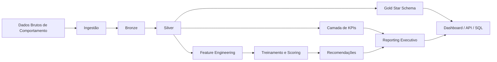

# Revenue Intelligence Platform

Plataforma end-to-end de revenue intelligence que transforma dados de comportamento em analytics reproduzível, KPIs de negócio, previsões de machine learning e ações executivas priorizadas.

[](https://www.python.org/)
[](https://streamlit.io/)
[](https://scikit-learn.org/)
[](https://www.docker.com/)
[](https://github.com/samuelmaia-analytics/Revenue-Intelligence-Platform-End-to-End-Analytics-ML-System/actions/workflows/ci.yml)

[Read in English](README.md)

## App Ao Vivo

Streamlit Cloud:

- https://revenue-intelligence-platform.streamlit.app/

## Por Que Este Projeto Se Destaca

- Construído como plataforma, não como notebook isolado: camadas claras de ingestão, transformação, analytics, ML, reporting, API e dashboard
- Outputs orientados a negócio: risco de churn, propensão de recompra, eficiência por canal, ações priorizadas e simulação de impacto
- Execução reproduzível e com padrão de produção: manifesto de pipeline, quality report, model registry, testes e API versionada
- Operação de plataforma: fluxo opcional com Prefect, persistência em SQLite, monitoramento de drift, calibração e métricas semânticas
- Controles operacionais: exemplos de scheduler implantado, thresholds de alerta, hooks de notificação, write-back e ativos de governança dbt

## Resumo Executivo

- Problema de negócio: transformar dados comportamentais em decisões de proteção de receita e crescimento
- Usuários principais: Revenue Ops, Marketing, Finanças, Customer Success e liderança
- Entregas centrais: carteira priorizada, KPIs centralizados, modelos interpretáveis e storytelling executivo

## Problema de Negócio

Times comerciais raramente precisam de mais um notebook. Eles precisam de um sistema de decisão que responda:

- Quais clientes têm maior risco de churn e merecem esforço de retenção?
- Quais segmentos têm maior chance de recomprar e merecem estratégia de upsell?
- Quais canais de aquisição são eficientes o suficiente para ganhar orçamento?
- Qual é o impacto esperado das próximas 10 ações prioritárias?

Este repositório foi estruturado como uma plataforma analítica real, e não como um experimento isolado. O escopo original foi preservado, mas o fluxo agora está explícito de ponta a ponta: `raw -> transformed -> analytics -> ML -> insights`.

## Visão da Plataforma



## Arquitetura

### Camadas principais

- `src/ingestion.py`: ingestão e persistência da camada bronze
- `src/transformation.py`: padronização silver e base analítica de clientes
- `src/warehouse.py`: publicação da camada gold em star schema
- `src/metrics.py`: centralização de KPIs de receita e snapshot de negócio
- `src/analytics.py`: geração de artefatos analíticos desacoplados do treinamento
- `src/modeling.py`: pré-processamento, treino, scoring, registry e interpretação executiva
- `src/recommendation.py`: priorização da próxima melhor ação
- `src/reporting.py`: outputs executivos e simulações de impacto
- `src/quality.py`: validações de qualidade e integridade
- `src/orchestration.py`: pipeline reproduzível ponta a ponta
- `src/config.py`: configuração de runtime e paths

### Controles de reprodutibilidade

- `PipelineConfig` com seed determinística
- diretórios explícitos para `raw`, `bronze`, `silver`, `gold`, `processed` e `warehouse`
- `pipeline_manifest.json` com estágios, tempos e inventário de saídas
- `quality_report.json` com duplicidades, nulos e integridade referencial
- `monitoring_report.json` com diagnósticos de drift e calibração
- `semantic_metrics_catalog.json` derivado de definições declarativas
- model registry versionado em `data/processed/registry`

Documentação complementar:

- [docs/architecture.md](/C:/Users/samue/PycharmProjects/Revenue-Intelligence-Platform-End-to-End-Analytics-ML-System/docs/architecture.md)

## Workflow Analítico

### Fluxo `raw -> transformed -> analytics -> ML -> insights`

1. A fonte é carregada de `data/raw/` ou gerada sinteticamente como fallback determinístico.
2. A camada bronze preserva linhagem com metadados de ingestão.
3. A camada silver aplica checagem de colunas, tipagem, deduplicação, tratamento básico e integridade.
4. O feature engineering gera uma base cliente-nível com recência, frequência, monetário, ARPU e janelas futuras.
5. A camada gold publica `dim_*` e `fact_orders.csv` para consumo analítico desacoplado de ML.
6. A camada de métricas centraliza LTV, CAC, RFM, coorte, unit economics e snapshot executivo.
7. A camada de ML treina churn e próxima compra com avaliação temporal e leitura orientada ao negócio.
8. A camada de recomendação converte score em ação.
9. A camada de reporting empacota os outputs para liderança, operação e dashboard.
10. Os outputs principais também são persistidos em SQLite para consumo tipo warehouse.

## Abordagem de Machine Learning

### Targets

- `is_churned`: ausência de compra na janela futura de 90 dias
- `next_purchase_30d`: propensão de compra na janela futura de 30 dias

### Features

- comportamento: `recency_days`, `frequency`, `monetary`, `avg_order_value`
- ciclo de vida: `tenure_days`, `arpu`
- contexto de negócio: `channel`, `segment`

### Modelagem

- churn: `RandomForestClassifier`
- próxima compra: `LogisticRegression`
- pré-processamento: escala numérica + one-hot encoding
- avaliação: split temporal com fallback estratificado

### Valor para o negócio

- risco de churn apoia alocação de budget de retenção
- propensão de compra apoia timing de upsell e CRM
- scores são traduzidos em ação recomendada
- `metrics_report.json` agora inclui drivers relevantes para leitura executiva

## KPIs de Receita Centralizados

A lógica de métricas agora está tratada como contrato de negócio.

Principais métricas:

- `LTV`
- `CAC`
- `LTV/CAC`
- `ARPU`
- `RFM`
- `Retenção por coorte`
- `Contribution margin`
- `Payback period`
- `% de clientes em alto risco`
- `Simulação de impacto do top 10`

Código principal:

- [src/metrics.py](/C:/Users/samue/PycharmProjects/Revenue-Intelligence-Platform-End-to-End-Analytics-ML-System/src/metrics.py)
- [src/business_rules.py](/C:/Users/samue/PycharmProjects/Revenue-Intelligence-Platform-End-to-End-Analytics-ML-System/src/business_rules.py)

## Outputs Executivos

Saídas principais em `data/processed/`:

- `customer_features.csv`
- `scored_customers.csv`
- `recommendations.csv`
- `ltv.csv`
- `cac_by_channel.csv`
- `rfm_segments.csv`
- `cohort_retention.csv`
- `unit_economics.csv`
- `kpi_snapshot.json`
- `metrics_report.json`
- `executive_report.json`
- `executive_summary.json`
- `business_outcomes.json`
- `top_10_actions.csv`
- `quality_report.json`
- `pipeline_manifest.json`
- `monitoring_report.json`
- `semantic_metrics_catalog.json`
- `data/warehouse/revenue_intelligence.db`

Uso por público:

- operação: carteira priorizada e lista de ação
- growth/finanças: eficiência por canal e unit economics
- liderança: resumo executivo e simulação de impacto
- engenharia: qualidade de dados, registry e manifesto de pipeline

## Dashboard e Storytelling

O app Streamlit funciona como camada executiva de operação.

Entregas atuais:

- cards de contexto de negócio
- visão consolidada de KPIs
- eficiência por canal
- retenção por coorte
- lens de risco e crescimento
- sumário de performance dos modelos
- drivers dos modelos
- status de drift e sinal de calibração
- controles interativos de scenario planning
- carteira priorizada
- simulação de impacto das top 10 ações

Entrypoint:

- [app/streamlit_app.py](/C:/Users/samue/PycharmProjects/Revenue-Intelligence-Platform-End-to-End-Analytics-ML-System/app/streamlit_app.py)

## API

Camada FastAPI com:

- endpoint de health com telemetria e metadados do registry
- endpoint autenticado de scoring
- rotas versionadas em `/api/v1/*`

Serviço principal:

- [services/api/main.py](/C:/Users/samue/PycharmProjects/Revenue-Intelligence-Platform-End-to-End-Analytics-ML-System/services/api/main.py)

## Orquestração Agendada

O repositório agora inclui uma entrada opcional com Prefect para execuções agendadas em estilo produção:

- [src/prefect_flow.py](/C:/Users/samue/PycharmProjects/Revenue-Intelligence-Platform-End-to-End-Analytics-ML-System/src/prefect_flow.py)

Exemplo:

```powershell
python -c "from src.prefect_flow import run_prefect_flow; run_prefect_flow()"
```

Se Prefect não estiver instalado, o módulo falha com mensagem explícita.

## Persistência em Warehouse

O pipeline agora persiste tabelas centrais em um target de warehouse configurável:

- caminho: `data/warehouse/revenue_intelligence.db`
- tabelas: `dim_customers`, `dim_date`, `dim_channel`, `fact_orders`, `customer_features`, `scored_customers`, `recommendations`, `unit_economics`, `top_10_actions`
- targets suportados no código: `sqlite` e `postgres` opcional via `RIP_WAREHOUSE_TARGET`

Isso aproxima o projeto de uma plataforma analítica real e reduz dependência de consumo apenas em CSV.

## Monitoramento e Governança

- `monitoring_report.json`: status de drift e diagnósticos de calibração
- `monitoring_baseline.json`: snapshot de referência para futuras execuções
- `alerts_report.json`: avaliação de thresholds e payload de alertas para regressões
- `metrics/semantic_metrics.json`: definições semânticas no estilo dbt
- `semantic_metrics_catalog.json`: catálogo exportado para consumidores downstream

## Workflow de Write-Back

O dashboard agora suporta aprovação e write-back das ações recomendadas:

- registros aprovados são escritos em `data/processed/approved_actions.csv`
- registros aprovados são anexados à tabela `approved_actions` no warehouse configurado
- isso fecha o ciclo entre insight analítico e ação operacional

## Camada Semântica com dbt

O repositório agora inclui um projeto dbt dedicado sobre o warehouse SQLite:

- [dbt/dbt_project.yml](/C:/Users/samue/PycharmProjects/Revenue-Intelligence-Platform-End-to-End-Analytics-ML-System/dbt/dbt_project.yml)
- [dbt/models/marts/finance/portfolio_semantic_metrics.sql](/C:/Users/samue/PycharmProjects/Revenue-Intelligence-Platform-End-to-End-Analytics-ML-System/dbt/models/marts/finance/portfolio_semantic_metrics.sql)
- [dbt/models/marts/finance/channel_semantic_metrics.sql](/C:/Users/samue/PycharmProjects/Revenue-Intelligence-Platform-End-to-End-Analytics-ML-System/dbt/models/marts/finance/channel_semantic_metrics.sql)

O que isso adiciona:

- modelos staging sobre as tabelas do warehouse
- marts semânticos orientados a finanças
- testes nativos do dbt na camada curada
- exposures para dashboard e API
- source freshness checks com SLA explícito para modelos alimentados pelo warehouse
- profiles dbt environment-aware para local, CI e execução com Postgres
- alinhamento entre `metrics/semantic_metrics.json` e o modelo semântico no dbt

O publish de docs dbt também foi endurecido:

- target dbt específico para CI
- `dbt debug` antes da geração de docs
- `dbt source freshness` antes do publish
- workflow de publicação dos artefatos em GitHub Pages

## Estrutura do Repositório

```text
.
|- app/
|- contracts/
|- data/
|  |- raw/
|  |- bronze/
|  |- silver/
|  |- gold/
|  \- processed/
|- docs/
|- notebooks/
|- services/
|  \- api/
|- sql/
|- src/
|- tests/
|- main.py
\- README.md
```

## Como Rodar

```powershell
py -3.11 -m venv .venv
.\.venv\Scripts\activate
python -m pip install --upgrade pip
python -m pip install -r requirements.txt -r requirements-dev.txt
python main.py
python -m streamlit run .\app\streamlit_app.py
python -m uvicorn services.api.main:app --reload --host 0.0.0.0 --port 8000
```

## CLI

```powershell
python -m src.pipeline run
python -m src.pipeline run --seed 123 --log-level DEBUG
```

### Variáveis de ambiente

- `RIP_DATA_DIR`
- `RIP_SEED`
- `RIP_LOG_LEVEL`
- `RIP_APP_LANG_MODE`
- `RIP_MODEL_DIR`
- `RIP_WAREHOUSE_TARGET`
- `RIP_WAREHOUSE_URL`
- `RIP_API_AUTH_MODE`
- `RIP_API_KEYS`
- `RIP_ALERT_WEBHOOK_URL`
- `RIP_ALERT_DRIFT_FEATURE_COUNT_WARN`
- `RIP_ALERT_BRIER_SCORE_WARN`

## Testes e Qualidade

```powershell
.\.venv\Scripts\python.exe -m pytest -q
```

Cobertura automatizada atual:

- contratos de saída do pipeline
- comportamento da API
- integridade de transformação
- outputs executivos
- KPIs centralizados
- pré-processamento
- quality gate
- persistência em warehouse
- outputs de drift monitoring
- export do catálogo semântico
- lógica de scenario simulation
- estrutura do projeto dbt e alinhamento com a camada semântica
- geração de alertas
- persistência de write-back
- cobertura de assets operacionais

## Melhorias Futuras

- templates gerenciados para Prefect Cloud, MWAA ou Astronomer
- adapters de warehouse para BigQuery e Snowflake
- sinks de alerta para Slack, Teams ou PagerDuty com secrets gerenciados
- papéis de aprovação, trilha de auditoria e sync downstream com CRM
