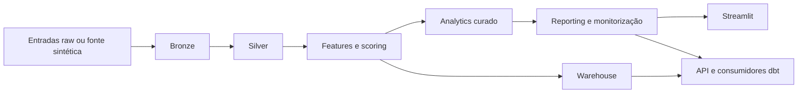

# Revenue Intelligence Platform

Repositório de analytics de receita orientado para produção que transforma comportamento de clientes e encomendas em saídas batch governadas, tabelas para warehouse, artefactos executivos de decisão e um workspace Streamlit para acção comercial.

Versões disponíveis:

- [Internacional](README.md)
- [Português do Brasil](README.pt-BR.md)

## Resumo Executivo

Este repositório foi desenhado para responder às perguntas que um hiring manager, tech lead ou avaliador sénior costuma fazer sobre projectos de dados:

- existe um caminho oficial de execução?
- o pipeline é reprocessável com segurança?
- os outputs são governados e validados?
- há evidência operacional quando algo falha?
- o dashboard consome artefactos confiáveis em vez de reimplementar a lógica crítica?

Resposta curta: sim.

## Porque Este Repositório Existe

Muitos projectos de portefólio ficam presos a notebooks, scripts ad hoc ou um dashboard isolado. Este repositório é intencionalmente mais operacional:

- um entrypoint batch oficial
- saídas determinísticas e reprocessáveis
- manifests, logs, snapshots e retenção de execução
- artefactos processados com validação e contratos
- consumidores downstream que leem o core batch em vez de o substituir

O objectivo não é simular uma plataforma enterprise sem substância. O objectivo é demonstrar critério de engenharia num repositório pequeno o suficiente para ser auditado de ponta a ponta.

## Valor de Negócio

A plataforma converte comportamento de clientes em activos que suportam decisões comerciais e de retenção:

- risco de churn e propensão de próxima compra
- unit economics por canal de aquisição
- retenção por coorte
- recomendações por cliente com impacto simulado
- snapshots executivos de KPI e monitorização
- tabelas de warehouse prontas para SQL e consumo ao estilo dbt

## Caminho Oficial de Execução

```powershell
python -m src.pipeline run
```

O pipeline batch é a fonte oficial de verdade. O Streamlit, a API, o warehouse e o projecto dbt consomem os outputs produzidos por ele.

## Arquitectura



Características principais:

- arquitectura batch-first com reprodutibilidade local
- política explícita de runtime para retry, retenção, freshness e thresholds de qualidade
- validação de artefactos processados antes da conclusão do pipeline
- warehouse SQLite por omissão, com caminhos compatíveis para serviços e dbt

## Estrutura do Repositório

```text
.
|- .github/                workflows de CI, templates e governação do repositório
|- app/                    camada de apresentação em Streamlit
|  |- ui/                  primitives reutilizáveis e estilos
|  |- views/               secções da página e composição do dashboard
|  |- dashboard_data.py    carregamento com cache e filtros
|  |- dashboard_i18n.py    dicionários EN, PT-BR e PT-PT
|  |- dashboard_metrics.py helpers partilhados de formatação e KPIs
|- src/                    pipeline batch, modelação, reporting e política operacional
|- contracts/              schemas governados versionados e shims de compatibilidade
|- tests/                  cobertura comportamental, confiabilidade, contratos e warehouse
|- docs/                   arquitectura, onboarding, runbooks, ADRs e release notes
|- scripts/                smoke tests e automações operacionais leves
|- dbt/                    camada analítica downstream sobre os outputs do warehouse
|- services/               interfaces de serviço voltadas a runtime
|- orchestration/          exemplos de scheduler e wrappers de deploy
|- metrics/                definições de métricas semânticas consumidas pelo pipeline
|- data/                   outputs locais de runtime, manifests, snapshots e warehouse
|- notebooks/              exploração isolada, fora do caminho oficial de execução
|- api/                    shim de compatibilidade para imports da API
```

Referências principais:

- [docs/README.md](docs/README.md)
- [docs/architecture.md](docs/architecture.md)
- [docs/repository_structure.md](docs/repository_structure.md)
- [docs/runbook.md](docs/runbook.md)
- [docs/troubleshooting_matrix.md](docs/troubleshooting_matrix.md)
- [docs/release_process.md](docs/release_process.md)
- [docs/deprecation_policy.md](docs/deprecation_policy.md)
- [docs/merge_policy.md](docs/merge_policy.md)
- [docs/hiring_review.md](docs/hiring_review.md)

## Sinais de Maturidade em Engenharia de Dados

- execução idempotente e reprocessável
- retry configurável por estágio
- janela explícita de backfill na CLI e nos manifests
- relatórios de freshness, qualidade e validação de artefactos processados
- manifests, logs e snapshots para rastreabilidade
- persistência em warehouse com validação de consumo downstream
- dashboard Streamlit com smoke test no CI

## Workspace Streamlit

O dashboard não é uma segunda fonte de verdade. Consome os artefactos processados e está organizado em:

- `app/ui` para primitives de layout e consistência visual
- `app/views` para secções de negócio e fluxo de leitura
- `app/dashboard_data.py` para acesso com cache aos artefactos
- `app/dashboard_i18n.py` para `EN`, `PT-BR` e `PT-PT`

## Setup Local

```powershell
python -m venv .venv
.venv\Scripts\activate
python -m pip install --upgrade pip
python -m pip install -r requirements.txt -r requirements-dev.txt
Copy-Item .env.example .env
```

Setup opcional do CLI `dbt` num ambiente isolado:

```powershell
python -m venv .dbt-venv
.dbt-venv\Scripts\activate
python -m pip install --upgrade pip
python -m pip install dbt-core dbt-sqlite
```

Variáveis de ambiente mais importantes:

- `RIP_DATA_DIR`
- `RIP_WAREHOUSE_TARGET`
- `RIP_RETRY_ATTEMPTS`
- `RIP_QUALITY_MAX_NULL_FRACTION`
- `RIP_BACKFILL_START_DATE`
- `RIP_BACKFILL_END_DATE`

## Comandos Principais

Pipeline:

```powershell
python -m src.pipeline run
```

Backfill:

```powershell
python -m src.pipeline run --start-date 2025-01-01 --end-date 2025-03-31
```

Streamlit:

```powershell
streamlit run app/streamlit_app.py
```

Fluxo com Make:

```powershell
make verify
make smoke-dashboard
make pipeline
```

## Validação e Automação

Comandos centrais:

```powershell
python -m ruff check .
python -m black --check .
python -m isort --check-only .
python -m mypy src services contracts main.py
python -m pytest -q
python scripts/smoke_dashboard.py
python scripts/smoke_api.py
python scripts/smoke_downstream_sql.py
python scripts/smoke_processed_exports.py
python scripts/smoke_dbt_sqlite.py
python -m build
```

Camadas de automação:

- `Makefile` para o fluxo local do developer
- `.pre-commit-config.yaml` para gates rápidos antes do commit
- `.github/workflows/ci.yml` para lint, testes, smoke e build
- `.github/workflows/ci.yml` também valida consumo dbt real sobre o warehouse SQLite gerado pelo pipeline

## Exemplos de Consumo SQL

Consulta de receita por canal no warehouse persistido:

```sql
SELECT
    acquisition_channel,
    ROUND(SUM(revenue), 2) AS total_revenue,
    ROUND(AVG(avg_order_value), 2) AS avg_order_value
FROM fact_orders
GROUP BY acquisition_channel
ORDER BY total_revenue DESC;
```

Consulta das acções recomendadas com maior impacto potencial:

```sql
SELECT
    customer_id,
    recommended_action,
    ROUND(potential_impact, 2) AS potential_impact,
    ROUND(churn_probability, 4) AS churn_probability
FROM mart_customer_recommendations
ORDER BY potential_impact DESC
LIMIT 10;
```

## Decisões Técnicas e Trade-offs

- SQLite é o warehouse por omissão porque a reprodutibilidade local vale mais do que exigir infraestrutura externa.
- O projecto é batch-first por escolha. Demonstra analytics engineering disciplinado sem fingir ser uma plataforma completa de streaming.
- O Streamlit consome artefactos em vez de recalcular a lógica crítica, preservando um único caminho oficial de execução.
- Compat shims existem, mas os caminhos canónicos continuam explícitos e documentados.

## Ordem Recomendada de Leitura

Se o objectivo é avaliar profundidade técnica, leia nesta ordem:

1. este `README`
2. [docs/architecture.md](docs/architecture.md)
3. [docs/runbook.md](docs/runbook.md)
4. [docs/troubleshooting_matrix.md](docs/troubleshooting_matrix.md)
5. [docs/adr/README.md](docs/adr/README.md)
6. [docs/repository_structure.md](docs/repository_structure.md)
7. [docs/hiring_review.md](docs/hiring_review.md)

## O Que Este Repositório Não É

- não é uma colecção de notebooks
- não é um monorepo enterprise fictício
- não é uma demo de streaming
- não é um clone de plataforma de MLOps

É um sistema batch orientado para produção, dimensionado de forma honesta para um portefólio sénior forte.

## Roadmap

Próximos passos com maior impacto:

1. expandir contratos e validação dos artefactos processados
2. aprofundar validação downstream de warehouse e dbt
3. acumular mais release notes pequenas e coerentes
4. adicionar uma estratégia leve de regressão visual para o dashboard

## Contribuição

Veja [CONTRIBUTING.md](CONTRIBUTING.md) para expectativas de workflow, convenção de commits, validação e boundaries do repositório.
