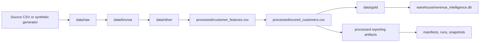

# Architecture Overview

## Intent

This repository is a small but production-minded analytical system. The design goal is not maximum feature breadth. The goal is to make the operating model, boundaries, and failure behavior easy to inspect.

The batch pipeline is the productized core. Everything else is downstream, optional, or supportive.

## System Boundary

Primary responsibility:

- ingest customer and order behavior
- validate and curate analytical layers
- score churn and next-purchase models
- generate governed reporting artifacts
- persist warehouse-ready tables
- emit operational evidence for every run

Explicit non-goals:

- streaming execution
- online feature serving
- multi-tenant SaaS architecture
- distributed compute orchestration

## Official Runtime Path

The official entrypoint is:

```powershell
python -m src.pipeline run
```

That command resolves runtime policy from [`src/config.py`](/C:/Users/samue/PycharmProjects/Revenue-Intelligence-Platform-End-to-End-Analytics-ML-System/src/config.py) and executes the orchestration flow in [`src/orchestration.py`](/C:/Users/samue/PycharmProjects/Revenue-Intelligence-Platform-End-to-End-Analytics-ML-System/src/orchestration.py).

## Layered Flow

1. `raw`
   Optional source CSV is read from `data/raw/`. If no source is present, deterministic synthetic data is generated.
2. `bronze`
   Raw tables are copied with source lineage metadata and ingestion timestamps.
3. `silver`
   Required-column validation, deduplication, type normalization, and referential cleanup.
4. `features`
   Customer-level analytical base with recency, frequency, monetary, tenure, ARPU, and supervised targets.
5. `gold`
   Curated star schema with `dim_customers`, `dim_date`, `dim_channel`, and `fact_orders`.
6. `modeling`
   Churn and next-purchase model training, scoring, and model registry updates.
7. `analytics`
   Recommendations, unit economics, KPI snapshots, and downstream business outputs.
8. `monitoring`
   Numeric drift summary, calibration report, and alert generation.
9. `operations`
   Warehouse persistence, manifests, logs, snapshots, freshness checks, and retention.

## Data Flow



## Runtime Policy

Operational policy is environment-driven and explicit in configuration:

- log level
- random seed
- freshness threshold
- retry attempts and retry backoff
- null-density quality threshold
- snapshot retention policy
- failure-manifest retention policy
- warehouse target and connection target
- alert thresholds and optional webhook

This keeps operational behavior inspectable and testable instead of scattering `os.getenv` reads across the codebase.

## Reliability Controls

Implemented controls:

- `run_id` for each execution
- input fingerprint for traceability
- raw input metadata with file fingerprints and source timestamps
- atomic writes for CSV and JSON outputs
- atomic SQLite replacement
- success and failure manifests
- historical snapshot per run
- retention by run count and age
- centralized run log with contextual `run_id`
- configurable retry of transient stage failures

## Quality and Governance

Current quality controls:

- required-column validation on silver inputs
- duplicate-key detection
- referential integrity checks
- configurable total null-density threshold
- quality report persisted as an artifact

Current governance controls:

- versioned contracts in [`contracts/v1/data_contract.py`](/C:/Users/samue/PycharmProjects/Revenue-Intelligence-Platform-End-to-End-Analytics-ML-System/contracts/v1/data_contract.py)
- generated data dictionary
- semantic metrics catalog generated from `metrics/semantic_metrics.json`
- processed artifact validation for critical CSV and JSON outputs

Decision records:

- [ADR 0001 - Batch pipeline is the system of record](/C:/Users/samue/PycharmProjects/Revenue-Intelligence-Platform-End-to-End-Analytics-ML-System/docs/adr/0001-batch-first-system-of-record.md)
- [ADR 0002 - SQLite is the default warehouse](/C:/Users/samue/PycharmProjects/Revenue-Intelligence-Platform-End-to-End-Analytics-ML-System/docs/adr/0002-sqlite-default-warehouse.md)
- [ADR 0003 - Streamlit consumes processed artifacts](/C:/Users/samue/PycharmProjects/Revenue-Intelligence-Platform-End-to-End-Analytics-ML-System/docs/adr/0003-streamlit-consumes-artifacts.md)

## Optional Interfaces

These modules are intentionally downstream of the batch core:

- Streamlit dashboard in `app/`
- FastAPI service in `services/api/`
- dbt project in `dbt/`
- Airflow and Prefect examples in `orchestration/`

They should consume generated outputs or the warehouse. They should not become alternate orchestration centers.

## Trade-offs

- SQLite is the default warehouse because local reproducibility is more valuable than requiring external infra.
- The repository stays file-based for transparency and easier review.
- Governance is selective and pragmatic rather than platform-scale.
- Batch is the center of gravity because that is the strongest fit for the size and purpose of this project.
