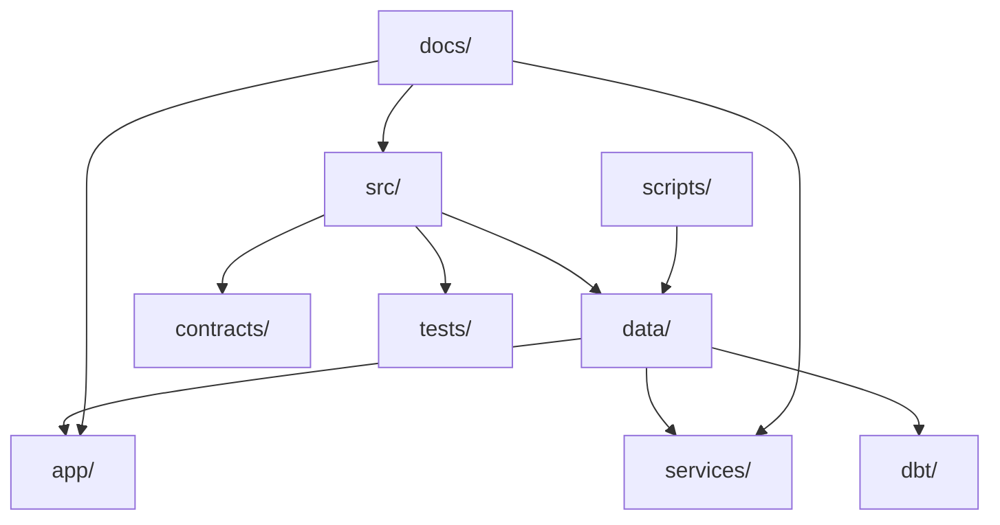

# Repository Structure

## Organizing Principle

The repository is organized around one rule: the batch pipeline is the system of record.

Every top-level directory should do one of three things:

- implement the batch core
- validate the batch core
- consume outputs produced by the batch core

If a directory does none of those, it probably does not belong at the top level.

## Top-Level Layout

```text
.
|- .github/            CI workflows, issue templates, PR template
|- api/                Compatibility shim for API imports
|- app/                Streamlit presentation layer
|  |- ui/              Reusable UI primitives, styles, layout tokens
|  |- views/           Dashboard sections and page composition
|- contracts/          Versioned governed schemas and shims
|- data/               Local runtime data, manifests, logs, snapshots, warehouse
|- dbt/                Downstream analytical models on top of warehouse outputs
|- docs/               Architecture, decisions, planning, releases
|- metrics/            Declarative semantic metric definitions
|- orchestration/      Optional scheduler wrappers and deployment examples
|- scripts/            Operational smoke tests and lightweight automation
|- services/           Runtime-facing service interfaces
|- sql/                Warehouse DDL and downstream SQL examples
|- src/                Batch pipeline and domain logic
|- tests/              Behavioral and regression coverage
```

## Relationship Map



## Directory Responsibilities

### `src/`

Authoritative home for:

- ingestion
- validation
- transformation
- modeling
- reporting
- monitoring and alerting
- persistence
- orchestration
- CLI entrypoints

Rule:
Business logic belongs here first.

### `app/`

Presentation layer for the generated artifacts.

Rule:
UI code should read artifacts or warehouse outputs. It should not duplicate orchestration logic or recompute business-critical logic ad hoc.

Subdirectories:

- `ui/` for reusable layout primitives and styles
- `views/` for page-level business sections

### `services/`

Runtime-facing service interfaces, currently centered on FastAPI.

Rule:
Services expose or consume the batch core. They do not own separate data pipelines.

### `contracts/`

Governed schemas and compatibility paths.

Rule:
New governed outputs should be versioned deliberately instead of overwriting historical contract meaning.

### `dbt/`

Analytical models that sit on top of persisted warehouse tables.

Rule:
dbt remains downstream of the batch core.

### `orchestration/`

Examples for Airflow and Prefect deployment shapes.

Rule:
Scheduler examples must call the official batch path instead of inventing a second orchestration truth.

### `data/`

Local runtime state.

Important subdirectories:

- `raw/`
- `bronze/`
- `silver/`
- `gold/`
- `processed/`
- `warehouse/`
- `manifests/`
- `runs/`
- `snapshots/`

Rule:
Treat `data/` as execution output. Do not use it as a permanent home for source code or documentation.

### `tests/`

Regression coverage for:

- pipeline behavior
- contracts
- runtime artifacts
- reliability controls
- warehouse persistence
- API behavior

Rule:
Prefer behavioral assertions over file-existence-only tests whenever practical.

### `sql/`

Supplementary SQL assets for:

- warehouse DDL
- downstream analytical examples

Rule:
`sql/` documents or exercises downstream consumption. It does not become the main transformation engine while the batch core remains canonical.

## Import Policy

Preferred imports:

- contracts from `contracts.v1.data_contract`
- API entrypoint from `services.api`

Compatibility shims exist in:

- `api/`
- `contracts/data_contract.py`
- `src/data_contract.py`

Rule:
Use shims only where backward compatibility matters. Use the versioned path in new code.

See also:

- [deprecation_policy.md](/C:/Users/samue/PycharmProjects/Revenue-Intelligence-Platform-End-to-End-Analytics-ML-System/docs/deprecation_policy.md)
- [runtime_surfaces.md](/C:/Users/samue/PycharmProjects/Revenue-Intelligence-Platform-End-to-End-Analytics-ML-System/docs/runtime_surfaces.md)

## Placement Rules

When adding a new capability:

1. Put domain behavior in `src/`.
2. Put governed schemas in `contracts/`.
3. Add tests in `tests/`.
4. Update docs when runtime behavior changes.
5. Keep the official batch CLI as the system entrypoint.

## Anti-Patterns

Avoid:

- orchestration logic inside UI or API modules
- business rules duplicated across `src/`, `app/`, and `services/`
- documentation that claims behavior the code does not implement
- top-level directories with weak or decorative boundaries
- broad abstractions added before the operating model needs them

## Maintenance Rule

If the repository grows, sharpen boundaries before adding layers.

A smaller repository with explicit ownership reads as more senior than a larger repository with decorative structure and fuzzy responsibilities.
