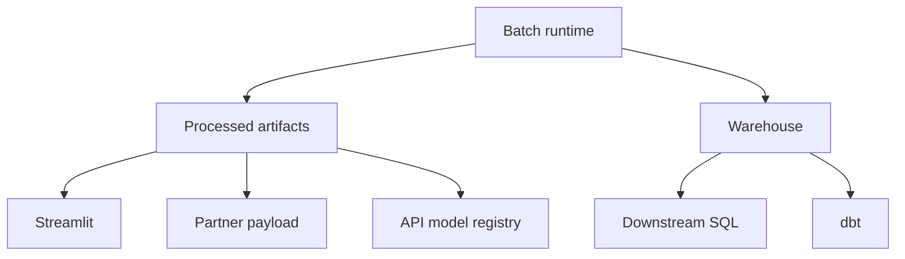

# Runtime Surfaces

This document explains the execution surfaces that exist in the repository and the boundaries between them.

## Canonical Surface

The canonical runtime surface is:

```powershell
python -m src.pipeline run
```

Everything else is downstream of that command.

## Surface Map



## Batch Runtime

Owner:
- `src/`

Purpose:
- ingest data
- validate and transform layers
- train models
- produce governed outputs
- persist warehouse artifacts
- emit operational evidence

Validation:
- pytest suite
- artifact validation
- quality reports
- manifests and snapshots

## Streamlit Workspace

Owner:
- `app/`

Purpose:
- expose business and operational views over processed artifacts

Rule:
- consume artifacts, do not become a second orchestration center

Validation:
- `scripts/smoke_dashboard.py`
- `scripts/ui_snapshot.py`

## API Surface

Owner:
- `services/api/`

Purpose:
- serve predictions and health status from the processed model registry

Rule:
- use registered models produced by the batch runtime

Validation:
- `scripts/smoke_api.py`
- API container smoke in CI

## Warehouse and SQL Consumption

Owner:
- `data/warehouse/`, `sql/`, `scripts/smoke_downstream_sql.py`

Purpose:
- support downstream analytical reads over persisted tables

Validation:
- `scripts/smoke_downstream_sql.py`
- shared temporary bootstrap in `scripts/smoke_support.py`

## dbt Surface

Owner:
- `dbt/`

Purpose:
- model warehouse outputs as a downstream analytics layer

Rule:
- remain downstream of the batch core

Validation:
- `scripts/smoke_dbt_sqlite.py`

## Partner Payload Surface

Owner:
- `scripts/export_partner_payload.py`

Purpose:
- expose a small partner-facing analytical payload built from processed artifacts

Rule:
- reuse governed outputs instead of creating a second business-logic path

Validation:
- `scripts/smoke_partner_payload.py`
- shared temporary bootstrap in `scripts/smoke_support.py`

## Surface Discipline

When adding a new execution surface:

1. keep the batch runtime canonical
2. define the surface owner
3. define the contract it consumes
4. add a smoke or regression path
5. document it here and in the README if it changes the reviewer story
